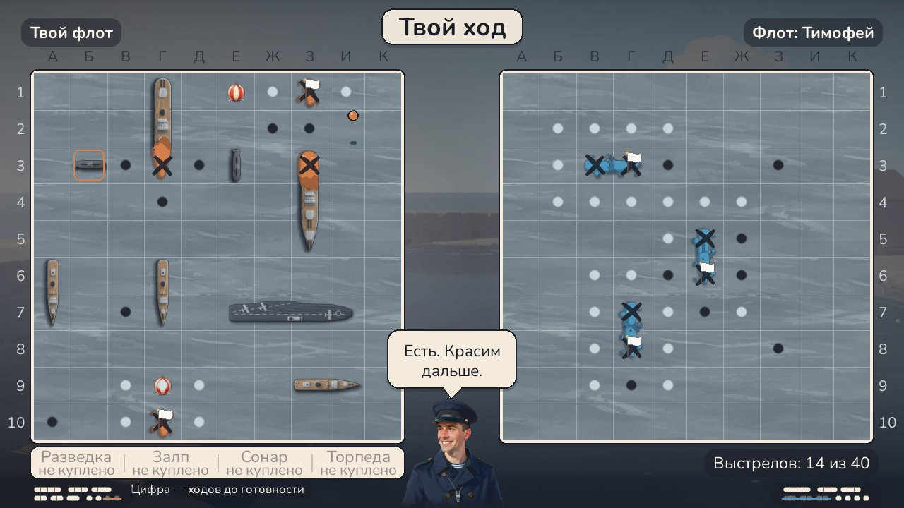
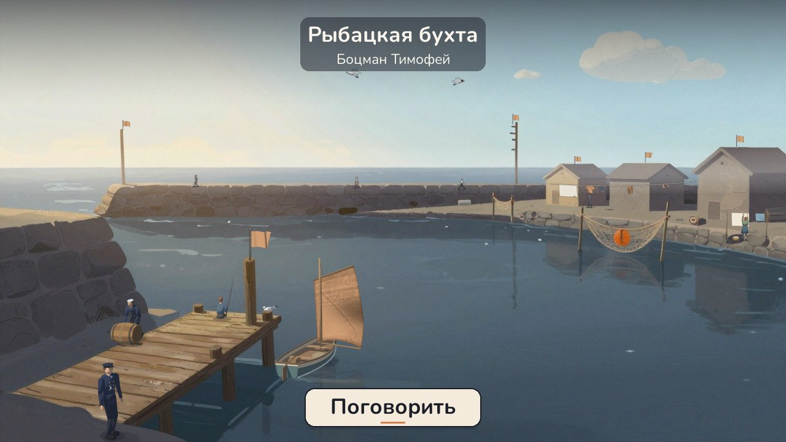
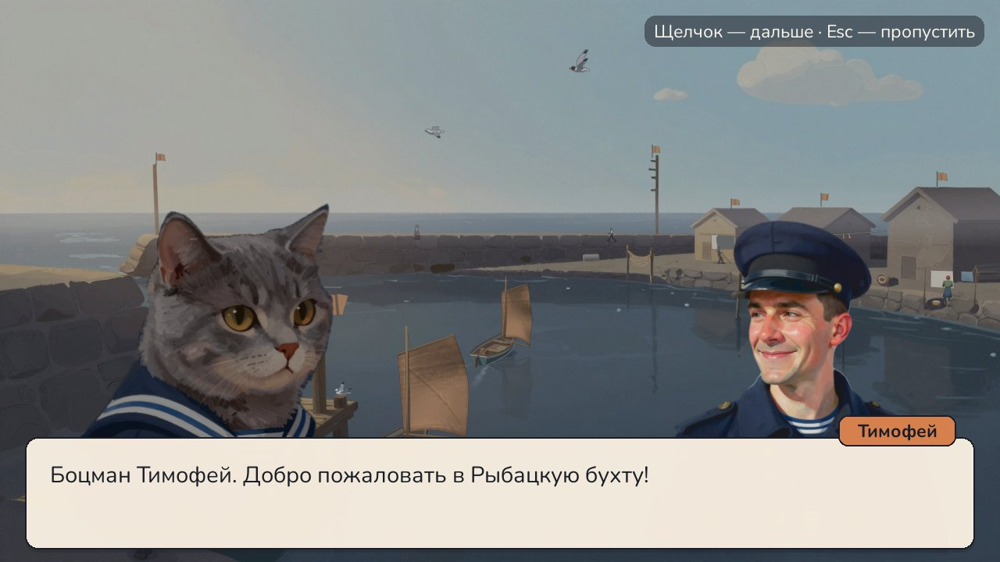

# Стальной залп

Морской бой, в котором никто не тонет: корабли стреляют краской. Python 3.14 + pygame-ce.



## Об игре

Это морской бой без взрывов и потопленных кораблей, потому что корабли стреляют друг в друга шарами с краской.
Если попал, то на палубе появляется клякса и можно стрелять ещё раз. А если промазал — ход сопернику.
Закрашенный корабль выкидывает белый флаг.

Особенности игры: есть возможность использовать бусты и способности, а при сохранении линкора или авианосца
до победы воспроизводится фаталити, если оно куплено на верфи.

Сейчас это демоверсия.





## Как запустить

Нужен Python 3.14.

```
py -3.14 -m pip install -r requirements.txt
py -3.14 main.py
```

На Windows можно просто запустить `Igrat.bat`. Если стоит обычный pygame, его лучше удалить: pygame и pygame-ce
мешают друг другу.

## Управление

- Мышь — кнопки, выбор порта на карте, выстрел по клетке поля противника.
- Щелчок, пробел или Enter — дальше. Esc — пропустить, назад, отмена.
- Расстановка: корабль тащить мышью, поворот — щелчок по кораблю, правая кнопка или R; щелчок по воде — мина.
- Бой: 1–4 — умения (если куплены на верфи), потом щелчок по клетке.
- F11 — полный экран.

Прогресс сохраняется в `progress.json` рядом с игрой. Удалить его — начать заново.

## Как устроен код

| Файл | Что внутри |
|---|---|
| `main.py` | запуск: звук, окно 1280×720 |
| `game/app.py` | игровой цикл и смена сцен |
| `game/nastroyki.py` | все числа игры: размеры, флот, цены, награды |
| `game/pole.py` | правила боя — поле, корабли, выстрел, умения, мины (без pygame) |
| `game/taktika.py` | как играет компьютер: добивание, шахматка, карта вероятностей |
| `game/kapitany/` | капитаны: каркас и боцман Тимофей |
| `game/sceny_boj.py` | расстановка, бой, итог, фаталити |
| `game/sceny_syuzhet.py` | меню, пролог, карта, бухта, разговоры, верфь |
| `game/buhta.py` | живая бухта: люди, лодки, чайки, туман |
| `game/progress.py` | сохранение |
| `game/resursy.py`, `risunki.py`, `effekty.py`, `zvuk.py`, `ui.py` | картинки и кэш, рисунки кодом, частицы, звук, кнопки |

Тексты и реплики лежат в `data/` в JSON, поэтому их можно менять без правки кода.

## Звуки и шрифт

- Свисток боцмана: «BosunCallAttention.wav», автор zimbot — [freesound.org/s/266159](https://freesound.org/s/266159/), CC BY 4.0.
- Остальные звуки — записи с [freesound.org](https://freesound.org) под CC0.
- Шрифт Nunito — The Nunito Project Authors, SIL Open Font License 1.1 (`fonts/OFL_Nunito.txt`).

Автор — Rombik177.
